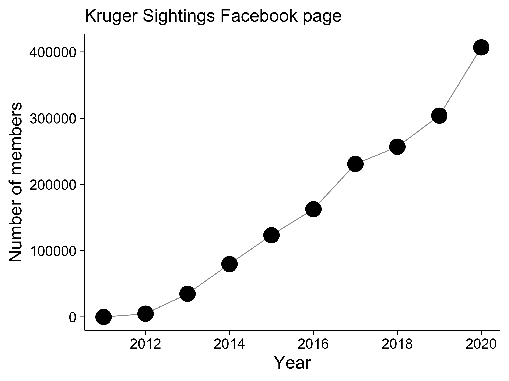

```{r, include = FALSE}
#--- Knitr options ---#
knitr::opts_chunk$set(echo = FALSE,
                      warning = FALSE,
                      message = FALSE)

#--- Load packages ---#
library(dplyr)
library(tidyr)
library(lubridate)
library(stringr)
library(readr)
library(janitor)
library(kableExtra)
library(ggplot2)

options(scipen = 9999)

#--- Import data ---#
aardvark <- read_csv('data/aardvark-data.csv') %>% 
    clean_names()

aardvark_predation <- read_csv('data/aardvark-data_drinking-and-predation.csv') %>% 
    clean_names()

pangolin <- read_csv('data/pangolin-data.csv') %>% 
    clean_names()

pangolin_predation <- read_csv('data/pangolin-data_drinking-and-predation.csv') %>% 
    clean_names()
```

----

# Aardvarks

## Number of records from Facebook and Instagram 

- All animals, dead and alive.

```{r}
aardvark %>% 
    select(source) %>% 
    mutate(source = str_to_title(source)) %>% 
    group_by(source) %>% 
    summarise(count = n()) %>% 
    ungroup() %>% 
    mutate(total = sum(count),
           percent = round(100 * (count / total), 0)) %>% 
    arrange(desc(percent)) %>% 
    kbl(caption = '(Aardvarks) Source of pictures by social media platform',
        booktabs = TRUE) %>% 
    kable_styling(latex_options = c('striped', 'HOLD_position', 'repeat_header'),
                  full_width = TRUE)
```

## Number of records from each country

- All animals, dead and alive.

```{r}
aardvark %>% 
    select(country) %>% 
    mutate(country = str_to_title(country)) %>% 
    group_by(country) %>% 
    summarise(count = n()) %>% 
    ungroup() %>% 
    mutate(total = sum(count),
           percent = round(100 * (count / total), 0)) %>% 
    arrange(desc(percent)) %>% 
    kbl(caption = '(Aardvarks) Source of pictures by country',
        booktabs = TRUE, longtable = TRUE) %>% 
    kable_styling(latex_options = c('striped', 'HOLD_position', 'repeat_header'),
                  full_width = TRUE)
```

## Where in South Africa are all the sightings (by province) 

- All animals, dead and alive.

```{r}
aardvarks_za <- aardvark %>% 
    filter(!is.na(province_region)) %>% 
    mutate(province_region = str_to_title(province_region)) %>% 
    mutate(country = str_to_title(country)) %>% 
    filter(country =='South Africa') %>% 
    select(province_region) %>% 
    group_by(province_region) %>% 
    summarise(count = n()) %>% 
    ungroup() %>% 
    mutate(total = sum(count),
           percent = round(100 * (count / total), 0)) %>% 
    arrange(desc(percent)) %>% 
    rename(province = province_region)

# Tabulate
aardvarks_za %>% 
    kbl(caption = '(Aardvarks) Source of pictures in South Africa by province',
        booktabs = TRUE, longtable = TRUE) %>% 
    kable_styling(latex_options = c('striped', 'HOLD_position', 'repeat_header'),
                  full_width = TRUE)
```

## Where in South Africa are all the sightings (by site) 

- All animals, dead and alive.

```{r}
aardvark %>% 
    #filter(!is.na(classified_area)) %>% 
    mutate(classified_area = str_to_title(classified_area)) %>% 
    mutate(country = str_to_title(country)) %>% 
    filter(country =='South Africa') %>% 
    select(classified_area, due_to_fenceless_border_i_put_them_under) %>% 
    mutate(classified_area = case_when(
        classified_area == 'Kgalagadi Transfontier Park' |
            classified_area == 'Kgalagadi Transforntier Park' ~ 'Kgalagadi Transfrontier Park',
        TRUE ~ classified_area
    )) %>% 
    mutate(classified_area = paste(classified_area, due_to_fenceless_border_i_put_them_under)) %>% 
    select(classified_area) %>% 
    mutate(classified_area = case_when(
        classified_area == 'Mpumalanga-Other Mpumalanga-Greater Kruger National Park' ~ 'Mpumalanga-Greater Kruger National Park',
        classified_area == 'Limpopo-Other Limpopo-Greater Kruger National Park' ~ 'Limpopo-Greater Kruger National Park',
        classified_area == 'Limpopo-Other Greater Kruger National Park' ~ 'Limpopo-Greater Kruger National Park',
        classified_area == 'Mpumalanga-Other NA' ~ 'Mpumalanga-Other',
        classified_area == 'Western Cape-Other NA' ~ 'Western Cape-Other',
        classified_area == 'Eastern Cape-Other NA' ~ 'Eastern Cape',
        classified_area == 'Kwazulu-Natal NA' ~ 'Kwazulu-Natal',
        classified_area == 'Gauteng NA' ~ 'Gauteng',
        classified_area == 'Free State NA' ~ 'Free State',
        classified_area == 'Great Karoo NA' ~ 'Western Cape-Great Karoo',
        classified_area == 'Limpopo-Other Greater Mapungubwe Transfontier Conservation Area' ~ 'Limpopo-Greater Mapungubwe Transfontier Conservation Area',
        str_detect(classified_area, 'Tswalu Kalahari Reserve') ~ 'Northern Cape-Tswalu Kalahari Reserve',
        str_detect(classified_area, 'Limpopo-Other NA') ~ 'Limpopo-Other',
        str_detect(classified_area, 'North West NA') ~ 'North West',
        str_detect(classified_area, 'Northern Cape-Other NA') ~ 'Northern Cape-Other',
        str_detect(classified_area, 'Kgalagadi Transfrontier Park NA') ~ 'Northern Cape-Kgalagadi Transfrontier Park',
        TRUE ~ classified_area
    )) %>% 
    group_by(classified_area) %>% 
    summarise(count = n()) %>% 
    ungroup() %>% 
    mutate(total = sum(count),
           percent = round(100 * (count / total), 0)) %>% 
    arrange(desc(classified_area)) %>% 
    rename(area = classified_area) %>% 
    kbl(caption = '(Aardvarks) Source of pictures in South Africa by site',
        booktabs = TRUE, longtable = TRUE) %>% 
    kable_styling(latex_options = c('striped', 'HOLD_position', 'repeat_header'),
                  full_width = TRUE)
```

## Number of alive animals

```{r}
alive_aardvark <- aardvark %>% 
    filter(alive_dead == 'alive') %>% 
    rename(condition = alive_dead) %>% 
    group_by(condition) %>% 
    summarise(count = n()) %>% 
    .$count
```

- Number of alive animals (across all countries): `r alive_aardvark`

## Daytime vs nightime sightings by year

- Across all countries.

- Alive animals only.

```{r}
aardvark_time <- aardvark %>% 
    filter(alive_dead == 'alive') %>% 
    mutate(year = factor(year(dmy(year)))) %>% 
    mutate(time = case_when(
        str_detect(time, 'afternoon') ~ 'afternoon',
        str_detect(time, 'sunset') ~ 'afternoon',
        str_detect(time, 'evening') ~ 'evening/night',
        str_detect(time, 'daylight') ~ 'daytime (not specified)',
        TRUE ~ time
    )) %>% 
    group_by(year, time) %>% 
    summarise(count = n()) %>% 
    group_by(year) %>% 
    mutate(total_by_year = sum(count),
           proportion_by_year = count / total_by_year) %>% 
    ungroup() %>% 
    complete(year, time, fill = list(count = 0,
                                     proportion_by_year = 0)) %>% 
    group_by(year) %>% 
    fill(total_by_year, .direction = 'updown') %>% 
    mutate(time = factor(time,
                         levels = c('morning', 'daytime (not specified)',
                                    'afternoon', 'evening/night'),
                         ordered = TRUE)) %>% 
    arrange(year, time)

aardvark_time %>% 
    mutate(percent_by_year = round(100 * proportion_by_year)) %>% 
    select(-proportion_by_year) %>% 
    kbl(caption = '(Aardvarks) Sighting by time of day and year',
        booktabs = TRUE, longtable = TRUE) %>% 
    kable_styling(latex_options = c('striped', 'HOLD_position', 'repeat_header'),
                  full_width = TRUE)
```

## Daytime vs nightime sightings by season 

- Across all countries.

- Alive animals only.

```{r}
aardvark_season <- aardvark %>% 
    filter(alive_dead == 'alive') %>% 
    select(year, time) %>% 
    mutate(month = month(dmy(year))) %>% 
    mutate(season = case_when(
        month == 12 |
            month == 1 |
            month == 2 ~ 'summer',
        month == 3 |
            month == 4 |
            month == 5 ~ 'autumn',
        month == 6 |
            month == 7 |
            month == 8 ~ 'winter',
        month == 9 |
            month == 10 |
            month == 11 ~ 'spring'
    )) %>% 
    mutate(time = case_when(
        str_detect(time, 'afternoon') ~ 'afternoon',
        str_detect(time, 'sunset') ~ 'afternoon',
        str_detect(time, 'evening') ~ 'evening/night',
        str_detect(time, 'daylight') ~ 'daytime (not specified)',
        TRUE ~ time
    )) %>% 
    group_by(season, time) %>% 
    summarise(count = n()) %>% 
    group_by(season) %>% 
    mutate(total_by_season = sum(count),
           proportion_by_season = count / total_by_season) %>% 
    ungroup() %>% 
    complete(season, time, fill = list(proportion_by_season = 0,
                                       count = 0,
                                       total_by_season = 140)) %>% 
    mutate(time = factor(time,
                         levels = c('morning', 'daytime (not specified)',
                                    'afternoon', 'evening/night'),
                         ordered = TRUE)) %>% 
    mutate(season = factor(season, 
                           levels = c('summer', 'autumn', 'winter', 'spring'),
                           ordered = TRUE)) %>% 
    arrange(season, time)

aardvark_season %>% 
    mutate(percent_by_season = round(100 * proportion_by_season)) %>% 
    select(-proportion_by_season) %>% 
    kbl(caption = '(Aardvarks) Sighting by time of day and season',
        booktabs = TRUE, longtable = TRUE) %>% 
    kable_styling(latex_options = c('striped', 'HOLD_position', 'repeat_header'),
                  full_width = TRUE)
```

## Number of social media posts by year

- Across all countries.

- All animals, dead and alive.

```{r}
aardvark %>% 
    select(year) %>% 
    mutate(year = factor(year(dmy(year)))) %>% 
    group_by(year) %>% 
    summarise(count = n()) %>% 
    kbl(caption = '(Aardvarks) Social media posts by year',
        booktabs = TRUE, longtable = TRUE) %>% 
    kable_styling(latex_options = c('striped', 'HOLD_position', 'repeat_header'),
                  full_width = TRUE)
```

## Number of drinking events

- Across all countries.

- Alive animals only.

```{r}
aardvark_predation %>% 
    select(month, drinking) %>% 
    mutate(month = month.abb[1:12]) %>% 
    kbl(caption = '(Aardvarks) Sighting of drinking events by month',
        booktabs = TRUE, longtable = TRUE) %>% 
    kable_styling(latex_options = c('striped', 'HOLD_position', 'repeat_header'),
                  full_width = TRUE)
```

## Number of predation episodes

- Across all countries

```{r}
predation_a <- aardvark_predation %>% 
    select(month, lion, leopard, hyena) %>% 
    mutate(month = month.abb[1:12]) %>% 
    pivot_longer(cols = -month,
                 names_to = 'predator',
                 values_to = 'count')

predation_a %>% 
    group_by(month) %>% 
    mutate(total_per_month = sum(count)) %>% 
    kbl(caption = '(Aardvarks) Predation events by predator and by month',
        booktabs = TRUE, longtable = TRUE) %>% 
    kable_styling(latex_options = c('striped', 'HOLD_position', 'repeat_header'),
                  full_width = TRUE)
```

\newpage

# Pangolins

## Number of records from Facebook and Instagram 

- All animals, dead and alive.

```{r}
pangolin %>% 
    select(source) %>% 
    mutate(source = str_to_title(source)) %>% 
    group_by(source) %>% 
    summarise(count = n()) %>% 
    ungroup() %>% 
    mutate(total = sum(count),
           percent = round(100 * (count / total), 0)) %>% 
    arrange(desc(percent)) %>% 
    kbl(caption = '(Pangolins) Source of pictures by social media platform',
        booktabs = TRUE) %>% 
    kable_styling(latex_options = c('striped', 'HOLD_position', 'repeat_header'),
                  full_width = TRUE)
```

## Number of records from each country

- All animals, dead and alive.

```{r}
pangolin %>% 
    select(country) %>% 
    mutate(country = str_to_title(country)) %>% 
    group_by(country) %>% 
    summarise(count = n()) %>% 
    ungroup() %>% 
    mutate(total = sum(count),
           percent = round(100 * (count / total), 0)) %>% 
    arrange(desc(percent)) %>% 
    kbl(caption = '(Pangolins) Source of pictures by country',
        booktabs = TRUE, longtable = TRUE) %>% 
    kable_styling(latex_options = c('striped', 'HOLD_position', 'repeat_header'),
                  full_width = TRUE)
```

## Where in South Africa are all the sightings (by province) 

- All animals, dead and alive.

```{r}
pangolins_za <- pangolin %>% 
    filter(!is.na(province_region)) %>% 
    mutate(province_region = str_to_title(province_region)) %>% 
    mutate(country = str_to_title(country)) %>% 
    filter(country =='South Africa') %>% 
    select(province_region) %>% 
    group_by(province_region) %>% 
    summarise(count = n()) %>% 
    ungroup() %>% 
    mutate(total = sum(count),
           percent = round(100 * (count / total), 0)) %>% 
    arrange(desc(percent)) %>% 
    rename(province = province_region)

# Tabulate
pangolins_za %>% 
    kbl(caption = '(Pangolins) Source of pictures in South Africa by province',
        booktabs = TRUE, longtable = TRUE) %>% 
    kable_styling(latex_options = c('striped', 'HOLD_position', 'repeat_header'),
                  full_width = TRUE)
```

## Where in South Africa are all the sightings (by site) 

- All animals, dead and alive.

```{r}
pangolin %>% 
    filter(!is.na(classified_area)) %>% 
    mutate(classified_area = str_to_title(classified_area)) %>% 
    mutate(country = str_to_title(country)) %>% 
    filter(country =='South Africa') %>% 
    select(classified_area, due_to_fenceless_border_i_put_them_under) %>% 
    mutate(classified_area = case_when(
        classified_area == 'Kgalagadi Transfontier Park' |
            classified_area == 'Kgalagadi Transforntier Park' ~ 'Kgalagadi Transfrontier Park',
        TRUE ~ classified_area
    )) %>% 
    mutate(classified_area = paste(classified_area, due_to_fenceless_border_i_put_them_under)) %>% 
    select(classified_area) %>% 
    mutate(classified_area = case_when(
        classified_area == 'Mpumalanga-Other Mpumalanga-Greater Kruger National Park' ~ 'Mpumalanga-Greater Kruger National Park',
        classified_area == 'Limpopo-Other Limpopo-Greater Kruger National Park' ~ 'Limpopo-Greater Kruger National Park',
        classified_area == 'Limpopo-Other Greater Kruger National Park' ~ 'Limpopo-Greater Kruger National Park',
        str_detect(classified_area, 'Tswalu Kalahari Reserve') ~ 'Northern Cape-Tswalu Kalahari Reserve',
        str_detect(classified_area, 'Limpopo-Other NA') ~ 'Limpopo-Other',
        str_detect(classified_area, 'North West NA') ~ 'North West',
        str_detect(classified_area, 'Northern Cape-Other NA') ~ 'Northern Cape-Other',
        str_detect(classified_area, 'Kgalagadi Transfrontier Park NA') ~ 'Northern Cape-Kgalagadi Transfrontier Park',
        TRUE ~ classified_area
    )) %>% 
    group_by(classified_area) %>% 
    summarise(count = n()) %>% 
    ungroup() %>% 
    mutate(total = sum(count),
           percent = round(100 * (count / total), 0)) %>% 
    arrange(desc(classified_area)) %>% 
    rename(area = classified_area) %>% 
    kbl(caption = '(Pangolins) Source of pictures in South Africa by site',
        booktabs = TRUE, longtable = TRUE) %>% 
    kable_styling(latex_options = c('striped', 'HOLD_position', 'repeat_header'),
                  full_width = TRUE)
```

## Number of alive animals

```{r}
alive_pangolin <- pangolin %>% 
    filter(alive_dead == 'alive') %>% 
    rename(condition = alive_dead) %>% 
    group_by(condition) %>% 
    summarise(count = n()) %>% 
    .$count
```

- Number of alive animals (across all countries): `r alive_pangolin`

## Daytime vs nightime sightings by year

- Across all countries.

- Alive animals only.

```{r}
pangolin_time <- pangolin %>% 
    filter(alive_dead == 'alive') %>% 
    mutate(year = factor(year(dmy(year)))) %>% 
    mutate(time = case_when(
        str_detect(time, 'afternoon') ~ 'afternoon',
        str_detect(time, 'sunset') ~ 'afternoon',
        str_detect(time, 'evening') ~ 'evening/night',
        str_detect(time, 'daylight') ~ 'daytime (not specified)',
        TRUE ~ time
    )) %>% 
    group_by(year, time) %>% 
    summarise(count = n()) %>% 
    group_by(year) %>% 
    mutate(total_by_year = sum(count),
           proportion_by_year = count / total_by_year) %>% 
    ungroup() %>% 
    complete(year, time, fill = list(count = 0,
                                     proportion_by_year = 0)) %>% 
    fill(total_by_year, .direction = 'down') %>% 
    mutate(time = factor(time,
                         levels = c('morning', 'daytime (not specified)',
                                    'afternoon', 'evening/night'),
                         ordered = TRUE)) %>% 
    arrange(year, time)

pangolin_time %>% 
    mutate(percent_by_year = round(100 * proportion_by_year)) %>% 
    select(-proportion_by_year) %>% 
    kbl(caption = '(Pangolins) Sighting by time of day and year',
        booktabs = TRUE, longtable = TRUE) %>% 
    kable_styling(latex_options = c('striped', 'HOLD_position', 'repeat_header'),
                  full_width = TRUE)
```

## Daytime vs nightime sightings by season 

- Across all countries.

- Alive animals only.

```{r}
pangolin_season <- pangolin %>% 
    filter(alive_dead == 'alive') %>% 
    select(year, time) %>% 
    mutate(month = month(dmy(year))) %>% 
    mutate(season = case_when(
        month == 12 |
            month == 1 |
            month == 2 ~ 'summer',
        month == 3 |
            month == 4 |
            month == 5 ~ 'autumn',
        month == 6 |
            month == 7 |
            month == 8 ~ 'winter',
        month == 9 |
            month == 10 |
            month == 11 ~ 'spring'
    )) %>% 
    mutate(time = case_when(
        str_detect(time, 'afternoon') ~ 'afternoon',
        str_detect(time, 'sunset') ~ 'afternoon',
        str_detect(time, 'evening') ~ 'evening/night',
        str_detect(time, 'daylight') ~ 'daytime (not specified)',
        TRUE ~ time
    )) %>% 
    group_by(season, time) %>% 
    summarise(count = n()) %>% 
    group_by(season) %>% 
    mutate(total_by_season = sum(count),
           proportion_by_season = count / total_by_season) %>% 
    ungroup() %>% 
    complete(season, time, fill = list(proportion_by_season = 0)) %>% 
    mutate(time = factor(time,
                         levels = c('morning', 'daytime (not specified)',
                                    'afternoon', 'evening/night'),
                         ordered = TRUE)) %>% 
    mutate(season = factor(season, 
                           levels = c('summer', 'autumn', 'winter', 'spring'),
                           ordered = TRUE)) %>% 
    arrange(season, time)

pangolin_season %>% 
    mutate(percent_by_season = round(100 * proportion_by_season)) %>% 
    select(-proportion_by_season) %>% 
    kbl(caption = '(Pangolins) Sighting by time of day and season',
        booktabs = TRUE, longtable = TRUE) %>% 
    kable_styling(latex_options = c('striped', 'HOLD_position', 'repeat_header'),
                  full_width = TRUE)
```

## Number of social media posts by year

- Across all countries.

- All animals, dead and alive.

```{r}
pangolin %>% 
    select(year) %>% 
    mutate(year = factor(year(dmy(year)))) %>% 
    group_by(year) %>% 
    summarise(count = n()) %>% 
    kbl(caption = '(Pangolins) Social media posts by year',
        booktabs = TRUE, longtable = TRUE) %>% 
    kable_styling(latex_options = c('striped', 'HOLD_position', 'repeat_header'),
                  full_width = TRUE)
```

## Number of drinking events

- Across all countries.

- Alive animals only.

```{r}
pangolin_predation %>% 
    select(month, drinking) %>% 
    mutate(month = month.abb[1:12]) %>% 
    kbl(caption = '(Pangolins) Sighting of drinking events by month',
        booktabs = TRUE, longtable = TRUE) %>% 
    kable_styling(latex_options = c('striped', 'HOLD_position', 'repeat_header'),
                  full_width = TRUE)
```

## Number of predation episodes

- Across all countries

```{r}
predation_p <- pangolin_predation %>% 
    select(month, lion, leopard, hyena) %>% 
    mutate(month = month.abb[1:12]) %>% 
    pivot_longer(cols = -month,
                 names_to = 'predator',
                 values_to = 'count')

predation_p %>% 
    group_by(month) %>% 
    mutate(total_per_month = sum(count)) %>% 
    kbl(caption = '(Pangolins) Predation events by predator and by month',
        booktabs = TRUE, longtable = TRUE) %>% 
    kable_styling(latex_options = c('striped', 'HOLD_position', 'repeat_header'),
                  full_width = TRUE)
```

\newpage

# Kruger sightings

- Growth in Facebook membership on Kruger Sightings.

```{r}
ks <- data.frame(year = 2011:2020,
                 membership = c(1, 5000, 35000, 80000, 123500, 
                                162800, 231000, 257000, 304000, 
                                407000))

p1 <- ggplot(data = ks) +
    aes(x = year, 
        y = membership) +
    geom_line(colour = '#999999') +
    geom_point(colour = '#000000',
               size = 8) +
    labs(title = 'Kruger Sightings Facebook page',
         x = 'Year',
         y = 'Number of members') +
    scale_fill_brewer() +
    scale_x_continuous(breaks = c(2012, 2014, 2016, 2018, 2020)) +
    theme_minimal(base_size = 20) +
    theme(legend.position = 'top',
          legend.title = element_blank(),
          legend.text = element_text(size = 14),
          panel.grid = element_blank(),
          plot.title = element_text(size = 20),
          plot.background = element_rect(fill = '#FFFFFF',
                                         colour = '#FFFFFF'),
          axis.text = element_text(colour = '#000000'),
          axis.line = element_line(size = 0.5),
          axis.ticks = element_line(size = 0.5))

ggsave(filename = 'figures/kruger-sightings.png',
       plot = p1,
       height = 6, 
       width = 8)
```

